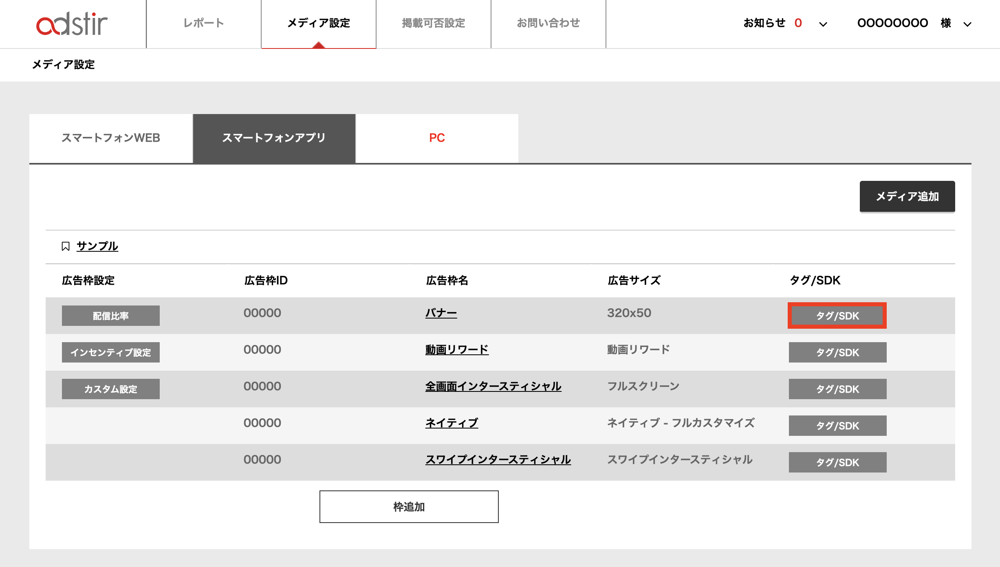

# WebViewアプリでのバナー広告の配信

adstirの広告タグを使用して、WebViewアプリで広告を配信することができます。  

## 広告ダグの取得

1. 管理画面にログインして、対象の枠の「タグ/SDK」を選択してください。


2. 「広告タグ」より広告タグを取得してください。

下記のような広告タグが取得いただけます。
```HTML
<script type="text/javascript">
var adstir_vars = {
  ver: "4.0",
  platform: "webview",
  app_id: "MEDIA-XXXXXXXX",
  ad_spot: 1,
  center: false
};
</script>
<script type="text/javascript" src="https://js.ad-stir.com/js/adstir.js"></script>
```

## originの追加
取得した広告タグにoriginパラメータを追加してください。  
originにはアプリのBundle Identifierを設定してください。

```HTML
<script type="text/javascript">
var adstir_vars = {
  ver: "4.0",
  platform: "webview",
  app_id: "MEDIA-XXXXXXXX",
  ad_spot: 1,
  center: false,
  origin: "com.foo.bar.baz" // Bundle Identifier
};
</script>
<script type="text/javascript" src="https://js.ad-stir.com/js/adstir.js"></script>
```

## IDFA（Advertising Identifier）の追加

アプリに掲載する広告は、広告識別子を送信することでさらなる収益化が可能になる場合があります。

広告識別子の取得方法は、下記取得サンプルと、[公式ドキュメント(英語)](https://developer.apple.com/library/ios/documentation/AdSupport/Reference/ASIdentifierManager_Ref/)をご覧下さい。
iOS 14以降では isAdvertisingTrackingEnabled はDeprecatedとなっているため、[App Tracking Transparency](https://developer.apple.com/documentation/apptrackingtransparency)を利用してオプトアウトの有無を判定します。


```swift tab=
// AdSupport.framework/AppTrackingTransparency.frameworkが必要です
import AdSupport
import AppTrackingTransparency
...
let identifierManager = ASIdentifierManager()
var idfa:UUID
if #available(iOS 14, *) {
    if (ATTrackingManager.trackingAuthorizationStatus != .denied ||
        ATTrackingManager.trackingAuthorizationStatus != .restricted) {
        idfa = identifierManager.advertisingIdentifier
    } else {
        // オプトアウト
    }
} else {
    // isAdvertisingTrackingEnabled はiOS 14以降、常にfalseになります
    if(identifierManager.isAdvertisingTrackingEnabled) {
        idfa = identifierManager.advertisingIdentifier
    } else {
        // オプトアウト
    }
}
```

```objective-c tab=
// AdSupport.framework/AppTrackingTransparency.frameworkが必要です
@import AdSupport;
@import AppTrackingTransparency;
...
ASIdentifierManager *identifierManager = [ASIdentifierManager sharedManager];
NSString *idfa;
if (@available(iOS 14, *)) {
    if (ATTrackingManager.trackingAuthorizationStatus != ATTrackingManagerAuthorizationStatusDenied &&
        ATTrackingManager.trackingAuthorizationStatus != ATTrackingManagerAuthorizationStatusRestricted) {
        idfa = identifierManager.advertisingIdentifier.UUIDString;
    } else {
        // オプトアウト
    }
} else {
    // isAdvertisingTrackingEnabled はiOS 14以降、常にNOになります
    if ([identifierManager isAdvertisingTrackingEnabled]) {
        idfa = identifierManager.advertisingIdentifier.UUIDString;
    } else {
        // オプトアウト
    }
}
```


HTMLを生成する際に`{ここに広告識別子を書き出す}`の部分を、取得した広告識別子で置換してください。なお、広告識別子は、IDFAの使用に記載の通り、オプトアウトされている場合の利用が制限されております。下記コードのコメントに記載の通り、適切な対応をお願い致します。 

```HTML
<script type="text/javascript">
var adstir_vars = {
  ver: "4.0",
  platform: "webview",
  app_id: "MEDIA-XXXXXXXX",
  ad_spot: 1,
  center: false,
  origin: "com.foo.bar.baz",
  lmt: false, // ユーザーがオプトアウトしている場合は、trueを設定してください
  id: "apple", // 広告識別子の種類(Apple - IDFA)
  uid: "{ここに広告識別子を書き出す}" // 広告識別子
};
</script>
<script type="text/javascript" src="https://js.ad-stir.com/js/adstir.js"></script>
```
