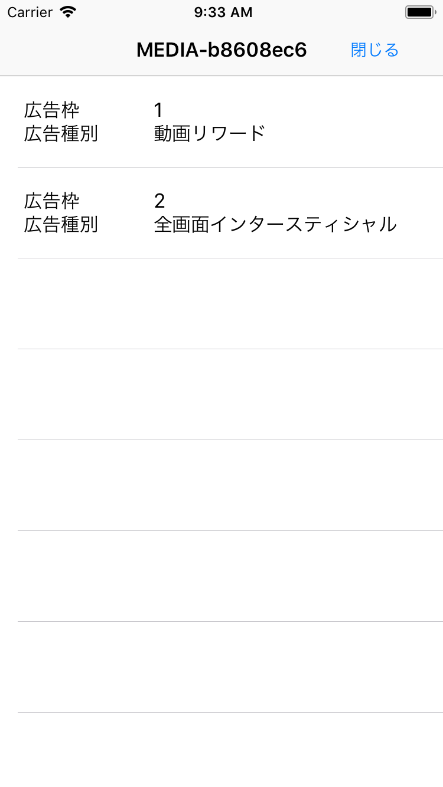
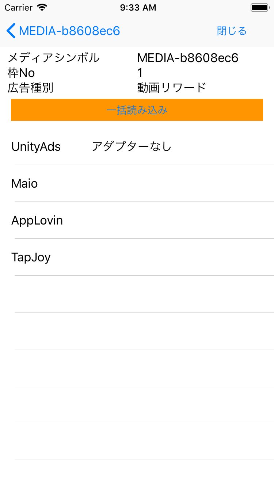
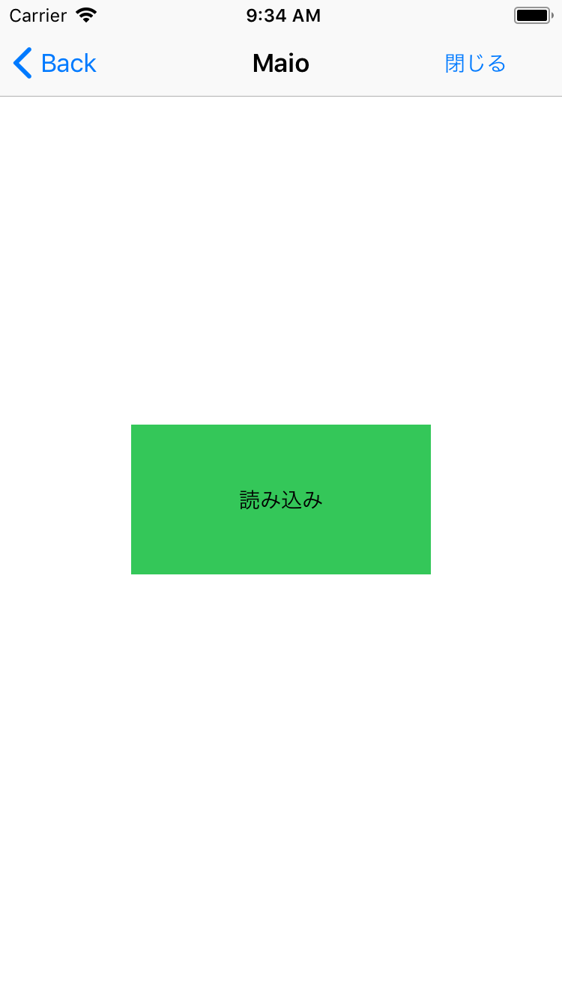

# adstirテストスイート

adstirテストスイートを利用することで、提携対応ネットワークのSDKとそのアダプターが、アプリに組み込まれていることを確認することができます。

## 前提条件

* iOS 9.0以上
* XCode 11以上

!!! Info
    アプリケーションをリリースする前にはadstirテストスイートのライブラリを削除をしてリリースをするようにお願いします。

### 対応広告

* 動画リワード
* 全画面インタースティシャル

## アプリケーションへの組み込み

### Podfileの作成

プロジェクトにPodfileが存在しない場合は、組み込む対象の.xcodeprojファイルがあるディレクトリに移動し、下記のコマンドでPodfileを作成します。

```bash
$ pod init
```

### Podfileの編集

任意のエディタでPodfileを開き、下記の様にadstir SDKについての記述を追記します。
platformの行は、プロジェクトに応じて適宜設定してください。

```ruby
platform :ios, "9.0"
pod 'AdstirTestSuite'

target 'projectname' do
  # use_frameworks!

  # Pods for projectname

end
```

### テストスイートのインストール

新規でテストスイートを追加する場合は下記のコマンドを実行します。

```bash
$ pod install
```

更新または削除をする場合は下記のコマンドを実行します。

```bash
$ pod update
```

新規でPodfileを作成した場合には、同じディレクトリに`プロジェクト名.xcworkspace`というファイルが作成されますので、そのファイルを開いてアプリケーションの開発を行います。
既存のPodfileに追記した場合は、引き続き同じワークスペースで開発を進めてください。

## テストスイートの利用

テストスイートのライブラリをインポートし、`AdstirVideoAds prepareWithMedia`で利用しているメディアシンボルと、枠Noを引数で渡し、テストスイートを起動します。

```Objective-c hl_lines="2"
#import <AdstirTestSuite/AdstirTestSuite.h>

[AdstirTestSuite launchWithMedia:@"MEDIA-XXXXXX" spots:@[@枠1, @枠2] onViewController:self];
```

指定した広告枠のリストが下記のように表示されます。

<p></p>


広告枠をタップすると、下記の画面に遷移します。
こちらの画面では、広告枠に対する下記の点を確認することができます。

* 広告枠に設定されている提携対応ネットワーク
* アダプター/SDKがアプリに導入されているか
* 広告の読み込みの可否

「一括読み込み」ボタンを押すことで、各提携対応ネットワークの読み込みを行い、広告表示が可能になったネットワークには「読み込み完了」と表示されます。

<p></p>

アドネットワーク名をタップすることで下記の画面に遷移します。

「読み鋳込みする」ボタンをタップすることで、表示中のネットワークの広告を読み込みます。
読み込みが完了すると、「広告表示」に表記が代わり、このボタンをタップすることで広告の表示を確認することができます。


<p></p>
